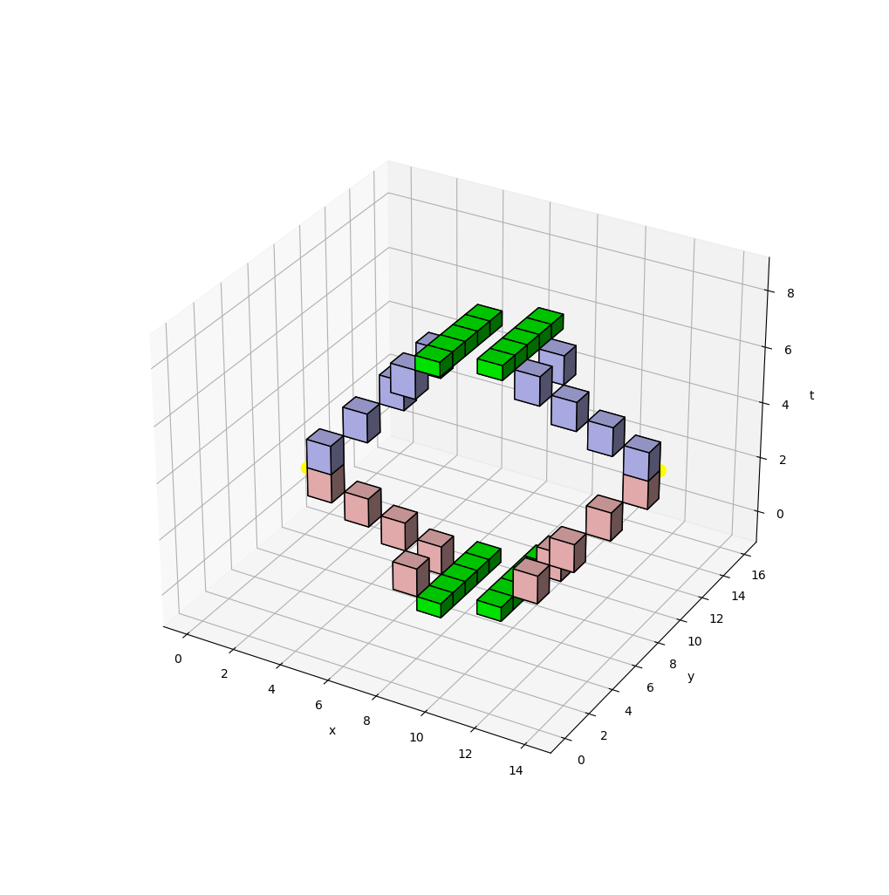

Ternary unitary quantum lattice models in 2 + 1 dimensions
==========================================================

Python implementation accompanying the manuscript [arXiv:2206.01499](https://arxiv.org/abs/2206.01499).

For a demonstration of the code, run `python3 equal_time_correlation.py`, which computes an equal-time correlation function and visualizes the required tensor network contraction:

References
----------
- Bruno Bertini, Pavel Kos, Tomaž Prosen  
  Exact correlation functions for dual-unitary lattice models in 1+1 dimensions  
  Phys. Rev. Lett. 123, 210601 (2019)
- Lorenzo Piroli, Bruno Bertini, J. Ignacio Cirac, Tomaž Prosen  
  Exact dynamics in dual-unitary quantum circuits  
  Phys. Rev. B 101, 094304 (2020)
